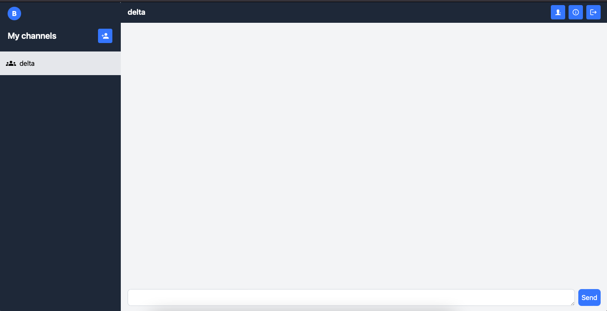

# Gossip

This is a real-time messaging application built with React on the frontend and Go and Redis on the backend. 

**Features**

- Group chat
- Authenticated users

**Installing**

For enabling authentication, you will need a domain and a client id from Auth0 to use it in a .env file in the client side.

Step 1:
```
   cd client
   npm install
   npm run dev
```
Step 2:
```
  cd server
  go run main.go
```
You will have to install air if you want live reloading support for go.

**Screenshot**

